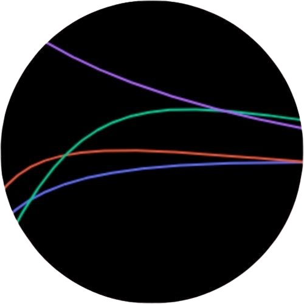

[](https://choosealicense.com/licenses/mit/)


# Dark Plotter

Dark Plotter is a Python package for visualizing velocity as a function of radius for the Milky Way galaxy in an interactive way. This Python package was developed as a project for the Code/Astro workshop in 2024. [Code/Astro 2024](https://github.com/semaphoreP/codeastro)

The study of the orbital velocity of the galactic disk has provided astronomers with insights into the nature of dark matter, a substance that is so far not well understood, despite composing approximately one-third of the universal energy density. The equations of gravity, both classic and relativistic, fail to explain why galactic rotation curves do not decay as quickly as we expect they should with increasing distance from the core. Mathematical models to describe the gravitational potential profiles for galaxies as a function of radius, including the Navarro-Frenk-White, Plummer, Hernquist, and Jaffe profiles offer different perspectives on a galaxy's mass and velocity distribution. However, researchers and students often face challenges in visualizing and comparing these models with observed data, emphasizing the need for an interactive tool to aid in the teaching and exploration of galactic dynamics. This tool enables the direct comparison of the observed Milky Way velocity profile with the included models. 

# Attribution
If you use this code in your research work, please refer to the package by its name and cite the authors! If you have any questions, feel free to open an issue through GitHub.

# Getting Started

## Prerequisites

Before using this program, you'll need the following:

* Python 3.10 or higher installed on your system.
* Jupyter notebook.

## Installation

You can install **Dark Plotter** on Windows, MacOS, and Linux distributions. In either case, we assume that you have already installed the dependencies and the appropriate Python version. There are two options to install **Dark Plotter**:

## GitHub

You can install the latest sources from **Dark Plotter** by cloning the repository directly from GitHub:
```
git clone https://github.com/brettonsimpson/darkplotter
cd darkplotter
pip install darkplotter
```
Or, instead, use `pip` with the path to the repository:
```
pip install darkplotter@git+https://github.com/brettonsimpson/darkplotter
```

## PyPI
A stable compiled version of **Dark Plotter** is available on [PyPI](https://pypi.org/). You can install it by running:
```
pip install darkplotter
```

## Testing

If you have installed the development version of **Dark Plotter** or cloned the complete source code (e.g., from the GitHub repository), you can run the tests by executing the following commands:

```python
cd darkplotter
python -m unittest -v
```

## Usage

1. Open Jupyter notebook.

2. Import the darkplotter :
``` python
import darkplotter
```
3. Use the plot function to create the interactive rotation curve plots.
``` python
DarkPlotter.plot()
```

## Contribution
1. Fork the repository and create a new branch for your feature or bug fix.

2. Make your changes, and ensure that your code follows the PEP 8 style guide.

3. Write tests to cover your code if applicable.

4. Create a pull request with a clear description of your changes and why they are needed.

5. Your pull request will be reviewed, and once approved, it will be merged into the main branch.

## License
This project is licensed under the MIT License - see the [LICENSE](https://github.com/brettonsimpson/group-13/blob/develop/LICENSE) file for details.

## Acknowledgement
The success of this project is due to the contributions of many.

* Deep appreciation goes to the contributors of this repository. Their efforts and shared knowledge have been essential.
* The instructors and teaching assistants who led the workshop and provided invaluable guidance throughout are gratefully acknowledged.
* Special thanks are extended to Suchitra Narayana, the teaching assistant for the group. Their support, patience, and insights significantly aided in the completion of this project.

